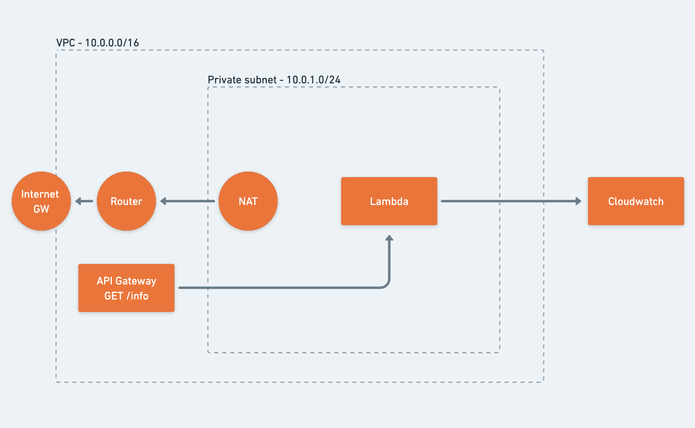

# Neara Software Engineer Infra test

In this practical, hands on test, we want to see how write infrastructure as code. The interview would have assessed existing knowledge and this is the actual implentation of a cut down, MVP version of the solution you worked on.

With this collaboration process, you will get some guidance from one of our team members on how to improve your code as if you worked here. You'll also learn the basics of some AWS networking and lambdas that get used in production.

It's a bit more time invested but it should give you a better experience in learning and how things would work.

## Checklist

- [x] VPC with correct CIDR block?
- [x] Lambda within private subnet?
- [x] Lambda reachable from API gateway?
- [x] Private and public subnet with correct CIDR blocks?
- [x] Route tables configured?
- [x] NAT Gateway in public subnet?
- [x] Internet Gateway attached to VPC?
- [x] Logs written to CloudWatch?
- [x] Internet access from private subnet (tested with separate Lambda in private subnet)?

## Instructions

### Prerequisites

- NodeJS
- AWS CLI
- Pulumi

### Steps

1. Configure your AWS credentials with user that possesses the policy AdministratorAccess. Use the following link for assistance with configuration: https://docs.aws.amazon.com/cli/latest/userguide/cli-configure-files.html
2. Run "npm install" from the root folder
3. Run "pulumi up --yes" in terminal
4. Copy and paste the endpoint value into your browser appended with "/dev/info"
5. Navigate to CloudWatch to observe logs

## Requirements

### Tech Stack

- Python 3.9
- [Pulumi for AWS](https://www.pulumi.com/docs/get-started/aws/)
- an AWS account (on the free tier, nothing here should cost you)
- provide instructions on how to run your code

### Objective

Build the following architecture in Pulumi:

We should be able to curl the API Gateway endpoint and get the json response returned from the lambda. Additionally, all logging output should go to Cloudwatch.

The lambda function is provided for you in the [./lambda](./lambda/) directory.

## Submitting and Collaboration

- fork this repo
- make the commits and changes necessary on a feature branch
- make an upstream pull request back to this repo and email us with your PR link
- the examiner can review the PR and make comments and ask you to improve the PR
- once the PR is rejected or accepted, you can delete the PR, we won't merge it
