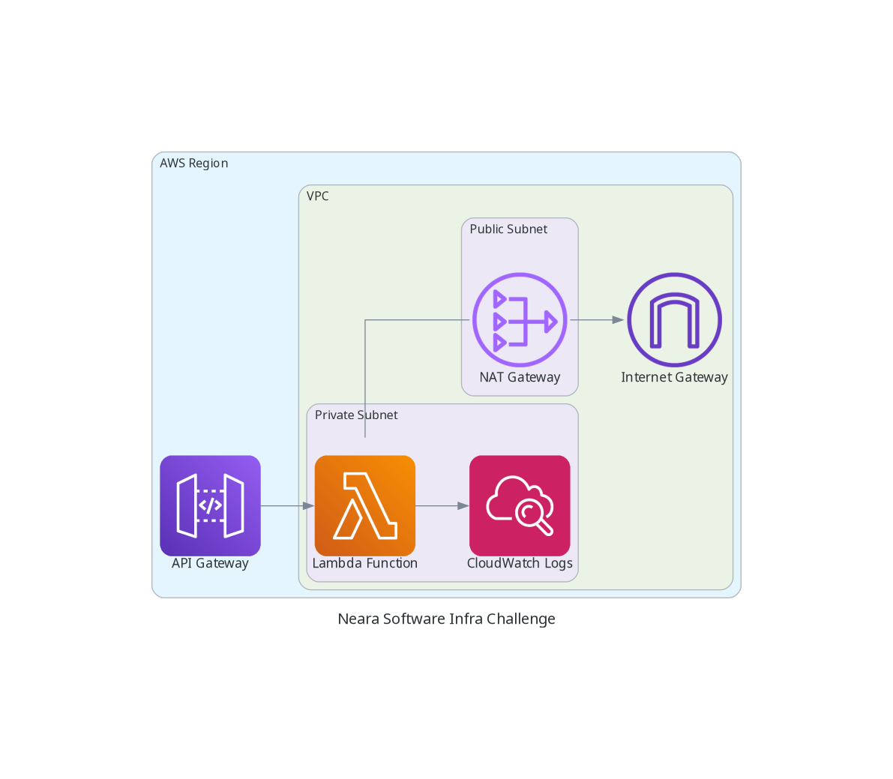

# Neara Software Infrastructure Challenge with Pulumi 🚀

This project is part of a challenge for Neara Software designed to demonstrate capabilities in using Pulumi for Infrastructure as Code (IaC) to deploy serverless applications on AWS. The original challenge details are provided in the [CHALLENGE.md](./CHALLENGE.md) file included in this repository.

## Acknowledgements 🙏

This Pulumi project is set up to create and manage AWS infrastructure for a serverless application using Lambda and API Gateway.

### Infrastructure Resources 🌐

The Pulumi project will create the following AWS resources:

- **Amazon VPC (Virtual Private Cloud):** A private network to deploy cloud resources securely.
- **Subnets:**
  - Public Subnet: Allows resources to access and be accessed from the internet.
  - Private Subnet: Resources here are not directly accessible from the internet.
- **NAT Gateway (Network Address Translation Gateway):** Enables resources in the private subnet to initiate outbound traffic to the internet.
- **Internet Gateway:** Connects the AWS VPC to the internet.
- **AWS Lambda Function:** Serverless compute service to run backend code without provisioning or managing servers.
- **API Gateway:** Fully managed service to create, publish, maintain, monitor, and secure APIs.
- **CloudWatch Logs:** Monitors and logs the AWS resources and applications.

<details>
<summary>Click to expand the diagram of the AWS infrastructure!</summary>



> This diagram was created using [Diagrams as Code](https://diagrams.mingrammer.com/). You can find the source file in the `tools/dac` directory.

</details>

## Requirements 🛠️

To get this project up and running, ensure you have the following installed on your machine:

- AWS CLI 🌐
- Pulumi CLI 🌩️
- Python 🐍

  **Python Version:** This project uses Python 3.9. You can manage different Python versions with [pyenv](https://github.com/pyenv/pyenv) to switch between projects seamlessly. For Windows, you can use [pyenv-win](https://github.com/pyenv-win/pyenv-win).

  ```sh
  pyenv install
  pyenv local
  ```

### Gotchas for Certain Environments 🧐

Depending on your development environment, you may also need to create and activate a virtual environment for Python. Follow these steps:

```sh
python3 -m venv venv
source venv/bin/activate
pip install -r requirements.txt
```

For Windows users using WSL2, ensure you have Docker Desktop installed, running, and configured with a [WSL2 connection](https://learn.microsoft.com/en-us/windows/wsl/tutorials/wsl-containers).

### Environment Setup 🌳

Before diving into the setup, make sure to configure your AWS CLI with the appropriate credentials:

```sh
aws configure
```

This step is crucial for Pulumi to interact with your AWS account.

## Setup the Development Environment 🛠️

- Clone the repository to your local machine and navigate to the project directory.

- Ensure you have Python 3.9 activated (using `pyenv` or another Python version management tool).

- Install project dependencies:

  ```sh
  pip install -r requirements.txt
  ```

- Install pre-commit hooks to ensure your commits meet the project standards:

  ```sh
  pre-commit install
  ```

## Deploying the Infrastructure 🌐

To deploy your infrastructure to AWS:

1. Initialize your Pulumi project if you haven't done so:

   ```sh
   pulumi stack init <your-stack-name>
   ```

2. Set the required configuration variables for your deployment:

   ```sh
   pulumi config set aws:region us-west-2 # Or your preferred AWS region
   pulumi config set project_name simple-lambda-test-infra # Or your project name
   pulumi config set environment dev # Or your target environment (dev, staging, prod)
   pulumi config set stage dev # Or your deployment stage
   ```

3. Deploy the infrastructure:

   ```sh
   pulumi up
   ```

   Review the planned changes and approve them to start the deployment.

## Testing the Deployment 🧪

Once your AWS resources are deployed, you can test the API Gateway endpoint using the `curl` command. Pulumi's CLI allows you to fetch the output variables from your deployment stack, which includes the URL of the API Gateway.

Here's how you can test your deployed endpoint:

```sh
curl "$(pulumi stack output apigatewayv2-http-endpoint)info"
```

The command above assumes that you have set an output in your Pulumi stack named `apigatewayv2-http-endpoint`. This should be the endpoint URL of your deployed API Gateway.

You should receive a response from your AWS Lambda function. Depending on the function's logic, this might be a JSON response, plain text, or any other output format you've defined.

In this case you should receive a JSON containing the AWS Region where the Lambda function lives.

## Clean Up 🧹

To avoid incurring any unintended charges and to clean up the resources that you have deployed:

1. Run the following command to destroy all resources:

   ```sh
   pulumi destroy
   ```

   Confirm the destruction of the resources when prompted to do so.

2. To remove the Pulumi stack completely, which includes all deployment history from the Pulumi Console:

   ```sh
   pulumi stack rm
   ```

Be cautious with this command as it will remove all history and metadata associated with the stack from Pulumi. This action is irreversible.
